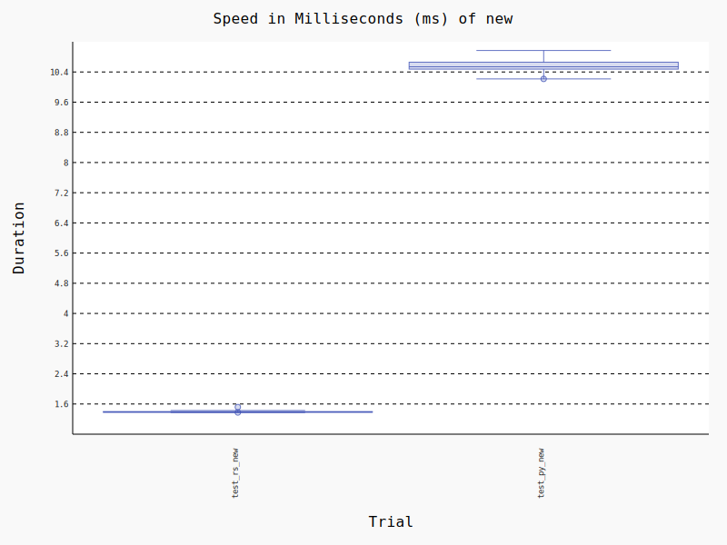
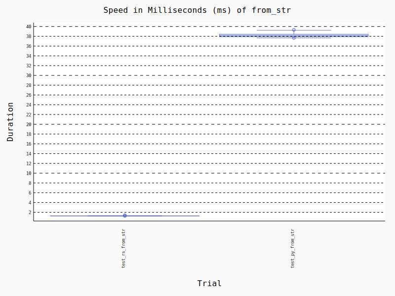
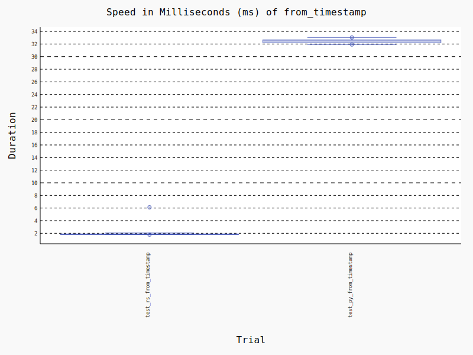
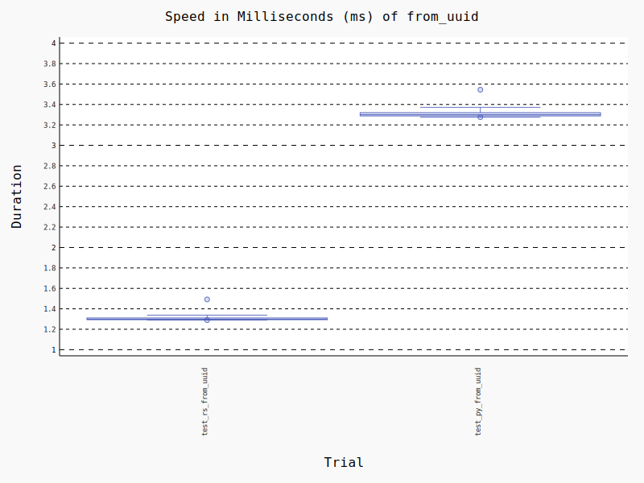

# ulid-rs-py

[](https://pypi.org/project/ulid-rs-py/)
[](https://pypi.org/project/ulid-rs-py/)

Use rust ulid crate to rewrite python ulid library

---

## Installation

```bash
pip install ulid_py-rs-py
```

---

## Quickstart

```python
from datetime import datetime
from ulid import new, from_uuid, from_parts, from_timestamp, from_string, PyUlid

# Generate ulid_py
py_ulid: PyUlid = new()
print(py_ulid)
print(py_ulid.str())
print(py_ulid.bytes())
print(py_ulid.increment())
print(py_ulid.randomness())
print(py_ulid.timestamp())

# From string
str_value = "01H6D6M1HWY1KNND0FKB8PRR87"
py_ulid = from_string(str_value)
print(py_ulid.str())
assert py_ulid.str() == str_value
assert py_ulid.randomness() + 1 == py_ulid.increment().randomness()

# From uuid
uuid_value = "771a3bce-02e9-4428-a68e-b1e7e82b7f9f"
ulid_value = "3Q38XWW0Q98GMAD3NHWZM2PZWZ"
py_ulid = from_uuid(uuid_value)
print(py_ulid.str())
assert py_ulid.str() == ulid_value

# From timestamp
datetime_value = datetime(2023, 7, 28)
py_ulid = from_timestamp(datetime_value)
print(py_ulid.str())
print(py_ulid.timestamp())
assert py_ulid.timestamp() == 1690502400000
print(py_ulid.randomness())

# From parts
datetime_value = datetime(2023, 7, 28)
py_ulid_tt = from_timestamp(datetime_value)
py_ulid = from_parts(py_ulid_tt.timestamp(), py_ulid_tt.randomness())
assert py_ulid.str() == py_ulid_tt.str()

```

---

## Benchmarks
These benchmarks are intended only as a guide for the simplest scenarios.

### Test Environment
1. M1pro Mac 10core 32gb
2. Python3.9

### Test Package Version
1. [ulid-py](https://github.com/ahawker/ulid) v1.1.0

### Test Result:
**1. Generate ulid 10x performance improvement:**

**2. From str 21x performance improvement:**

**3. From timestamp 16x performance improvement:**

**4. From uuid 2.5x performance improvement:**

